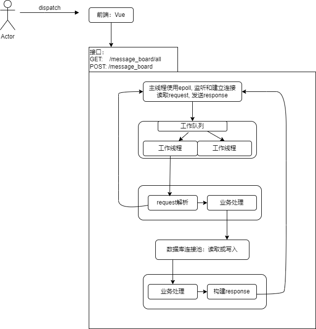

# 从头开始实现一个留言板

## 仓库目录结构
* 提供restful的代码：[TinyWebServer2](./TinyWebServer2)
* 前端页面代码：[fornt_page](./fornt_page)
* [Tiny-Web-Server](./Tiny-Web-Server)和[appendix](./appendix),非下面结构图中代码。是摸索时候的代码。

## 文档

演示与介绍视频：[从头实现一个留言板-BiliBili](https://www.bilibili.com/video/BV18P411g7tr/)

所有文档见：[从头实现一个web留言板](https://blog.csdn.net/sinat_38816924/category_12104405.html)

**罗马不是一天建成的。链接中的文档包含一个个独立可运行的代码。最后所有的代码逻辑，拼凑成这个项目**。(这是有趣的地方)

1. 稍微大点的代码，都需要日志，所以先了解日志该如何写：[spdlog日志库的封装使用](https://da1234cao.blog.csdn.net/article/details/126192561)
2. 类似的，稍微大点的代码，需要配置文件：[配置文件的读取-TOML](https://da1234cao.blog.csdn.net/article/details/126191313)
3. 项目和http密切相关，我们必须要知道http报文的基本结构：[http消息简介](https://da1234cao.blog.csdn.net/article/details/125275757)
4. 在了解http报文基本结构之后，我们需要考虑如何解析报文：[http-parse的C++封装](https://da1234cao.blog.csdn.net/article/details/127630903)
5. 和解析报文类似，我们得拼凑一个response，以便通过套接字发送，作为响应: [C++构建response](https://blog.csdn.net/sinat_38816924/article/details/127798345)
6. 此时，我们或许应该进行网络编程。但是，不着急，为了让每个请求使用单独的线程处理，我们还需要线程池：[C++线程池](https://da1234cao.blog.csdn.net/article/details/127666456)
7. 接下来，是网络编程，假定我们已经有一点套接字编程基础，我们使用epoll：[epoll实现Reactor模式](https://da1234cao.blog.csdn.net/article/details/127706646)
8. 最后，为了让数据持久化，我们使用数据库：[X DevAPI--C++ mysql数据库连接池](https://da1234cao.blog.csdn.net/article/details/127718756)

## 代码结构

## 项目部署与压力测试

项目在本地运行 + 项目不需要持久运行 + 懒得到服务器上重新搭建环境 = 内网穿透。选择使用[nps](https://github.com/ehang-io/nps/blob/master/README_zh.md)搭建内网穿透。

找了个在线网站，简单的压测了下。没咋明白每项指标的含义，但是没有错误是一眼可见的。

## 参考

[Linux C++基于Epoll从零开始实现HTTP服务器](https://github.com/Jsiyong/candy)